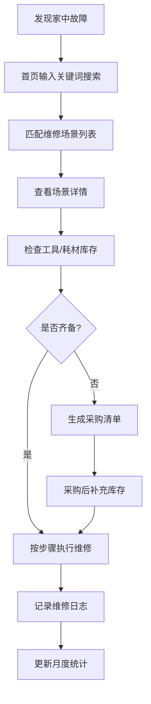

## 1. 产品概述

家庭维修技能学习与工具管理助手，帮助普通家庭用户系统学习50+种常见维修技能、管理家中工具与耗材库存、记录维修经验。通过知识+工具+经验的一体化管理，降低家庭维修对外部服务的依赖，培养动手能力并节省维修开支。

## 2. 核心功能

### 2.1 用户角色

| 角色 | 注册方式 | 核心权限 |
|------|---------|---------|
| 家庭用户 | 本地使用，无需注册 | 所有功能：知识库浏览、技能记录、库存管理、日志记录、统计查看 |

### 2.2 功能模块

1. **首页看板**：快速检索入口、月度统计概览、快捷操作导航、近期维修日志
2. **维修知识库**：50+场景分类展示、场景详情（工具/耗材/步骤/难度）、关键词匹配搜索
3. **我的技能**：已掌握技能标记、熟练度自评（1-5星）、按难度/分类筛选、学习进度统计
4. **工具库存**：工具CRUD、分类管理、存放位置记录、维修场景关联时自动检查齐备
5. **耗材库存**：耗材规格记录、数量追踪、低库存预警、自动补货清单
6. **维修日志**：维修记录CRUD、拍照存档、问题心得、耗时费用统计
7. **月度统计**：维修次数、节省费用估算、技能学习进度、库存预警汇总

### 2.3 页面详情

| 页面名称 | 模块名称 | 功能描述 |
|---------|---------|---------|
| 首页 | 快速搜索栏 | 输入故障关键词（漏水/跳闸/有洞等）自动匹配维修场景与清单 |
| 首页 | 统计卡片 | 当月维修次数、累计节省费用、已掌握技能数、库存预警数 |
| 首页 | 快捷入口 | 6大功能模块图标导航 |
| 首页 | 近期日志 | 最近5条维修记录摘要 |
| 知识库 | 分类筛选 | 按水电/木工/五金/家电/日常等分类 |
| 知识库 | 难度筛选 | 简单/中等/困难/专家四级 |
| 知识库 | 场景卡片 | 展示图标、名称、难度、预计耗时 |
| 场景详情 | 工具清单 | 列出所有必备工具，标注库存状态 |
| 场景详情 | 耗材清单 | 列出耗材及用量，标注库存状态 |
| 场景详情 | 步骤指南 | 分步骤图文操作说明 |
| 场景详情 | 采购建议 | 缺失工具/耗材一键加入采购清单 |
| 我的技能 | 技能列表 | 已标记技能、熟练度星级、学习日期 |
| 我的技能 | 难度分组 | 按四级难度分组展示 |
| 我的技能 | 学习进度 | 环形进度条统计各难度掌握比例 |
| 工具库存 | 工具列表 | 卡片展示名称、类型、品牌、位置 |
| 工具库存 | 新增/编辑 | 表单录入工具完整信息 |
| 工具库存 | 关联场景 | 查看工具可用于哪些维修项目 |
| 耗材库存 | 耗材列表 | 规格型号、剩余数量、单位、预警线 |
| 耗材库存 | 预警提示 | 低于阈值红色高亮，一键补货提醒 |
| 维修日志 | 日志列表 | 按时间倒序展示、筛选项目 |
| 维修日志 | 新增日志 | 表单+图片上传（base64本地存储） |
| 维修日志 | 详情展示 | 完整记录含图片画廊 |
| 月度统计 | 趋势图表 | 月度维修次数柱状图、节省费用折线 |
| 月度统计 | 分类统计 | 各分类维修占比饼图 |
| 月度统计 | 库存预警 | 工具/耗材缺失与低库存清单 |

## 3. 核心流程

用户发现家中故障 → 在首页搜索栏输入关键词 → 系统匹配对应维修场景 → 查看场景详情（步骤+难度）→ 自动检查工具/耗材库存 → 若齐备：开始维修 → 完成后记录维修日志 → 月度统计更新；若不齐备：缺失项加入采购清单。

## 4. 用户界面设计

### 4.1 设计风格

**整体方向：工业实用主义风格（Industrial Utility）**

- **主色调**：深靛蓝 `#1e3a5f`（专业可靠），辅助色：琥珀橙 `#f59e0b`（警示/操作），成功绿 `#10b981`（库存齐备），警示红 `#ef4444`（低库存/缺失）
- **按钮风格**：直角略带圆角（4px），实心填充+悬浮下沉效果，主按钮用深靛蓝
- **字体**：标题使用 `Noto Sans SC Bold`，正文 `Noto Sans SC Regular`，数字统计使用等宽字体 `JetBrains Mono`
- **布局风格**：卡片式布局+网格系统，每张卡片有细微阴影（1px），卡片标题用左侧竖条色带装饰
- **图标风格**：使用 lucide-react 线性图标，统一尺寸 20px，分类场景额外使用 emoji 增强识别
- **背景**：浅灰渐变 `#f8fafc → #f1f5f9`，内容卡片白色背景

### 4.2 页面设计概述

| 页面名称 | 模块名称 | UI元素 |
|---------|---------|---------|
| 首页 | 搜索栏 | 大号圆角搜索框+放大镜图标+灰色提示文字"输入故障关键词，如：漏水、跳闸、墙上有洞" |
| 首页 | 统计卡片 | 四个等宽卡片：左上角彩色竖条，大号数字+小字标签+趋势箭头 |
| 首页 | 快捷导航 | 2×3 图标按钮网格：每个 120px 方形图标+文字标签+悬浮放大效果 |
| 知识库 | 筛选栏 | 顶部固定：分类下拉+难度按钮组+搜索框，卡片网格 4列布局 |
| 知识库 | 场景卡片 | 顶部大图/图标+左下难度徽章+右下耗时标签+标题2行截断 |
| 场景详情 | 信息栏 | 顶部横幅：图标+标题+难度星级+预计时间+返回按钮 |
| 场景详情 | 清单区域 | 左右分栏：左工具清单（带库存状态标签），右耗材清单（带用量） |
| 场景详情 | 步骤区域 | 时间线样式：步骤编号圆形徽章+文字说明+占位图示 |
| 我的技能 | 进度区 | 顶部三个环形进度条（简单/中等/困难）+ 中心总掌握数 |
| 工具库存 | 列表 | 卡片3列布局，每张卡：图标徽章+名称+品牌小字+位置标签+删除按钮 |
| 耗材库存 | 列表 | 表格布局：名称+规格+数量条（进度条样式）+状态徽章+操作 |
| 维修日志 | 列表 | 时间线布局：左侧日期轴+右侧日志卡片+图片缩略图 |
| 月度统计 | 图表区 | 上半部分：左柱状图（维修次数）右折线图（节省费用），下半部分饼图+预警表 |

### 4.3 响应式

桌面优先设计（≥1280px），断点适配：
- ≥1024px：4列→3列网格，侧边栏完整显示
- ≥768px：3列→2列网格，导航标签紧凑
- <768px：单列布局，底部Tab导航替代侧边栏

所有表单控件支持触摸操作，最小点击区域44px。

### 4.4 图片资源
使用 text_to_image API 生成以下场景封面图：
- 水电维修类、木工类、家电类、五金类各1张代表性横幅图
- 首页 Hero 背景图（工具墙+工具箱特写）

其余场景使用 emoji 图标 + 渐变背景占位，避免过度依赖图片资源。
