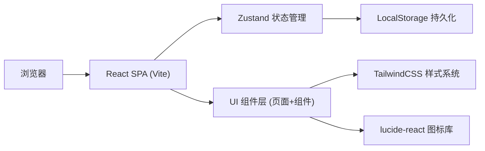
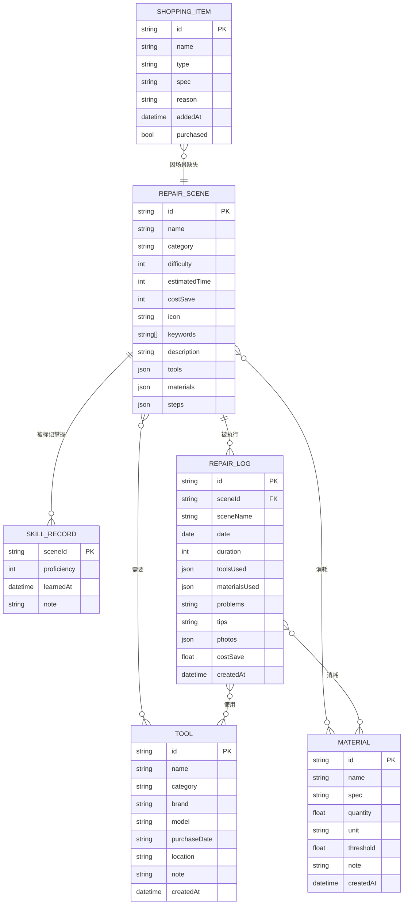

## 1. 架构设计

纯前端单页应用，使用 LocalStorage 做数据持久化，不依赖后端服务。



## 2. 技术说明

- **前端**：React@18.3 + TypeScript@5.8 + React Router@7.3
- **样式**：TailwindCSS@3.4（深色模式 class 策略）
- **构建工具**：Vite@6.3
- **状态管理**：Zustand@5.0（含 persist 中间件做 LocalStorage 持久化）
- **路由**：React Router DOM（7.3）
- **图标**：lucide-react@0.511
- **工具库**：clsx + tailwind-merge 组合类名
- **数据持久化**：localStorage（Zustand persist 中间件）
- **图表**：使用纯 CSS + Div 实现简易图表（无额外图表库依赖）

## 3. 路由定义

| Route | 页面 | 用途 |
|-------|-----|------|
| `/` | Dashboard | 首页看板（搜索、统计、导航、近期日志） |
| `/knowledge` | Knowledge | 维修知识库列表（分类/难度筛选） |
| `/knowledge/:id` | KnowledgeDetail | 维修场景详情（工具/耗材/步骤/库存检查） |
| `/skills` | Skills | 我的技能（已掌握标记、熟练度、进度统计） |
| `/tools` | Tools | 工具库存管理（CRUD + 位置/品牌） |
| `/materials` | Materials | 耗材库存管理（CRUD + 数量/预警） |
| `/logs` | Logs | 维修日志列表（时间线+筛选） |
| `/logs/new` | LogEditor | 新增/编辑维修日志（含图片上传） |
| `/logs/:id` | LogDetail | 维修日志详情（图片画廊） |
| `/stats` | Statistics | 月度统计看板（图表+预警） |

## 4. API 定义（无后端）

使用 Zustand store 暴露 Actions，所有数据本地存储：

```typescript
// 维修场景
interface RepairScene {
  id: string;
  name: string;
  category: 'plumbing' | 'electrical' | 'carpentry' | 'hardware' | 'appliance' | 'daily' | 'textile' | 'bike';
  difficulty: 1 | 2 | 3 | 4;  // 1简单 2中等 3困难 4专家
  estimatedTime: number;       // 分钟
  costSave: number;            // 预估节省费用(元)
  icon: string;                // emoji
  keywords: string[];          // 搜索关键词
  description: string;
  tools: { name: string; spec?: string }[];
  materials: { name: string; spec?: string; amount: number; unit: string }[];
  steps: { title: string; detail: string; tip?: string }[];
}

// 工具库存
interface Tool {
  id: string;
  name: string;
  category: string;
  brand?: string;
  model?: string;
  purchaseDate?: string;
  location: string;
  note?: string;
  createdAt: string;
}

// 耗材库存
interface Material {
  id: string;
  name: string;
  spec: string;
  quantity: number;
  unit: string;
  threshold: number;           // 预警阈值
  note?: string;
  createdAt: string;
}

// 技能记录
interface SkillRecord {
  sceneId: string;
  proficiency: 1 | 2 | 3 | 4 | 5;  // 熟练度星级
  learnedAt: string;
  note?: string;
}

// 维修日志
interface RepairLog {
  id: string;
  sceneId?: string;
  sceneName: string;
  date: string;
  duration: number;            // 耗时分钟
  toolsUsed: string[];
  materialsUsed: { name: string; amount: number }[];
  problems?: string;
  tips?: string;
  photos: string[];            // base64
  costSave?: number;
  createdAt: string;
}

// 采购清单项
interface ShoppingItem {
  id: string;
  name: string;
  type: 'tool' | 'material';
  spec?: string;
  reason: string;              // 关联场景名
  addedAt: string;
  purchased: boolean;
}
```

## 5. 数据模型 ER 图



## 6. 项目结构

```
src/
├── data/
│   └── scenes.ts             # 预置50+维修场景数据
├── store/
│   └── useAppStore.ts        # Zustand store (全部状态管理)
├── types/
│   └── index.ts              # TypeScript 类型定义
├── components/
│   ├── layout/
│   │   ├── Sidebar.tsx       # 左侧导航
│   │   └── Header.tsx        # 顶栏
│   ├── common/
│   │   ├── DifficultyBadge.tsx
│   │   ├── EmptyState.tsx
│   │   ├── StatCard.tsx
│   │   ├── Modal.tsx
│   │   └── StarRating.tsx
│   ├── knowledge/
│   │   ├── SceneCard.tsx
│   │   ├── SceneFilter.tsx
│   │   └── StepTimeline.tsx
│   ├── skills/
│   │   ├── ProgressRing.tsx
│   │   └── SkillCard.tsx
│   ├── inventory/
│   │   ├── ToolCard.tsx
│   │   ├── MaterialRow.tsx
│   │   ├── ToolForm.tsx
│   │   └── MaterialForm.tsx
│   ├── logs/
│   │   ├── LogTimeline.tsx
│   │   ├── LogForm.tsx
│   │   └── PhotoGallery.tsx
│   └── stats/
│       ├── BarChart.tsx
│       ├── LineChart.tsx
│       └── PieChart.tsx
├── pages/
│   ├── Dashboard.tsx
│   ├── Knowledge.tsx
│   ├── KnowledgeDetail.tsx
│   ├── Skills.tsx
│   ├── Tools.tsx
│   ├── Materials.tsx
│   ├── Logs.tsx
│   ├── LogEditor.tsx
│   ├── LogDetail.tsx
│   └── Statistics.tsx
├── lib/
│   └── utils.ts              # 工具函数（搜索匹配、日期格式化等）
├── hooks/
│   └── useTheme.ts           # 主题切换（保留已有）
├── App.tsx
├── main.tsx
└── index.css
```
